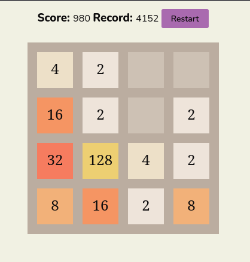

# 2048

A 2048 clone.


# Table of Contents

- [2048](#2048)
- [Table of Contents](#table-of-contents)
- [Usage](#usage)
- [Installation](#installation)
  - [Manual](#manual)
  - [With a script](#with-a-script)
  - [With a docker](#with-a-docker)
- [License](#license)

# Usage

Press arrows or swipe left, right, up or down to move tiles. Try to score 2048 to win. Press restart to try again.

# Installation

1. Clone repository 
```bash
git clone https://github.com/Vasya-556/2048.git
```
2. Go into project folder
```bash
cd 2048
```

## Manual
1. Install dependencies
```bash
npm install
```
2. Build
```bash
npm run build
```
3. Start server
```bash
npm run start
```

## With a script
1. Build project
```bash
./server.sh -b
```
2. Start server
```bash
./server.sh -s
```

## With a docker
1. Start Docker engine
2. Run
```bash
docker compose up
```

# License

[MIT](LICENSE)